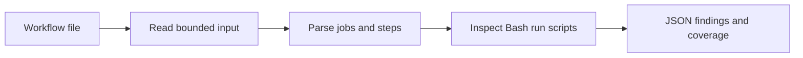

# Workflow Hardener

A small Go command-line tool that checks GitHub Actions workflows for direct pull-request title interpolation in Bash scripts. It reports findings with file locations and makes unsupported cases visible. Workflow files are read as data; their scripts are never executed.

## The problem

GitHub Actions substitutes expressions before passing a `run` script to the shell. A pull-request title is user-controlled, so inserting it directly into a script can introduce shell commands. [GitHub's script injection guidance](https://docs.github.com/en/actions/concepts/security/script-injections) explains this risk.

This tool flags the direct expression in an explicitly Bash step:

```yaml
- shell: bash
  run: printf '%s\n' "${{ github.event.pull_request.title }}"
```

Passing the title through an environment variable avoids direct insertion into this script:

```yaml
- shell: bash
  env:
    PR_TITLE: ${{ github.event.pull_request.title }}
  run: printf '%s\n' "$PR_TITLE"
```

This follows GitHub's [intermediate environment variable guidance](https://docs.github.com/en/actions/reference/security/secure-use#use-an-intermediate-environment-variable). The scanner checks this one pattern; it does not establish that a workflow is secure.

## How it works



There is one command, `scan`, and one rule, `WH-R001`. The only application dependency is `go.yaml.in/yaml/v3`, which preserves YAML source locations. AI assisted development; the executable does not use a model or contact a service.

## Demo

On GitHub, open **Actions → Scanner CI → Run workflow**. The workflow runs the tests, vets and builds the program, then displays these three examples in the run summary:

| Example | Expected result | Exit |
|---|---|---|
| [Direct title](testdata/risky-title.workflow.txt) | `match`, one finding | 1 |
| [Environment variable](testdata/env-title.workflow.txt) | `no_match` | 0 |
| [Inherited shell](testdata/default-shell-title.workflow.txt) | `unsupported` | 2 |

The inherited-shell example intentionally demonstrates a limitation. A successful demo checks all three expected outcomes, including exit 2. Full JSON reports are printed in the demo step's log.

With Go 1.27 or later, build and scan from the repository root. On Windows:

```text
go build -o bin/hardener.exe ./cmd/hardener
./bin/hardener.exe scan --file testdata/risky-title.workflow.txt
```

On Linux or macOS, use `-o bin/hardener` and run `./bin/hardener`. Repeat `--file` to scan more than one file. Use `--root DIR` to read paths beneath another directory; the default root is the current directory. The program writes JSON to standard output and usage or operational messages to standard error.

## Scope and limitations

- Only explicit step-level `shell: bash` is supported. Shell defaults, other shells, and reusable workflows are reported as unsupported.
- The rule recognizes `${{ github.event.pull_request.title }}` with optional surrounding spaces, tabs, or line breaks. Other or incomplete expressions make the entire step unsupported.
- Expressions in `env`, step names, and other fields are outside the rule. Action `uses` steps are counted but their implementations are not inspected.
- The rule inspects decoded script text, including shell comments. It does not evaluate conditions, shell behavior, exploitability, or data flow.
- Findings identify the start of the YAML `run` value, using one-based lines and columns and a zero-based step index.
- Input is limited to 50 explicit files, each at most 256 KiB. Invalid YAML, duplicate keys, multiple documents, aliases, merge keys, links, and paths outside the input root are rejected.

Exit **0** means supported analysis completed without a finding. Exit **1** means a finding was reported. Exit **2** means an error or incomplete analysis; findings from supported steps remain in the report. A workflow with no run steps is also unsupported.

## Code

- [`cmd/hardener/`](cmd/hardener/) contains the executable entry point and compiled CLI tests.
- [`internal/hardener/`](internal/hardener/) contains input handling, parsing, detection, reporting, and unit tests.
- [`testdata/`](testdata/) contains small synthetic workflow examples stored as inert `.workflow.txt` files.
- [The code walkthrough](docs/ARCHITECTURE.md) follows one input through the functions and explains the Go concepts involved.

Tests live beside their code in `_test.go` files. CI runs `go test ./...`, `go vet ./...`, and `go build`; the integration test checks actual process exit codes against all ten examples.
