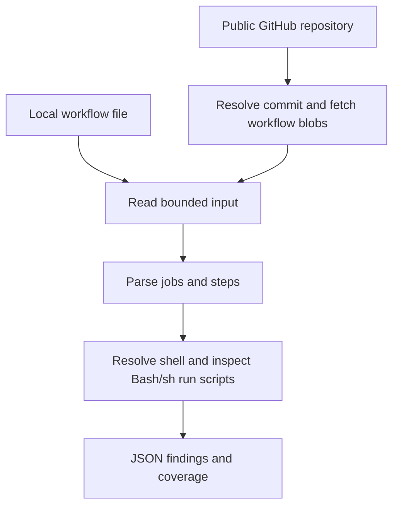

# Workflow Hardener

A small Go command-line tool that checks GitHub Actions workflows for direct pull-request title and body interpolation in Bash and `sh` scripts. It reports findings with file locations and makes unsupported cases visible. Workflow files are read as data; their scripts are never executed.

## Run entirely from GitHub

1. Open [Actions → Scan public repository](https://github.com/zorosz/workflow-hardener/actions/workflows/scan-repository.yml).
2. Choose **Run workflow**, select `main`, and enter a public repository URL or `OWNER/REPO` in the **repository** field.
3. Click **Run workflow**, then open the run summary to review **Findings** and **Coverage and errors**.
4. Download the **repository-scan** artifact for `report.json`, `stderr.txt`, and `exit-code.txt`.

You need [write access to this scanner repository](https://docs.github.com/en/actions/how-tos/manage-workflow-runs/manually-run-a-workflow) to start the workflow. Exit **0** means no findings within the supported rules; exit **1** means findings; exit **2** means incomplete analysis or an error. Both 1 and 2 mark the run failed, so read the summary for the reason.

Use the [GitHub search guide](docs/SEARCHING.md) to find candidate repositories. See [GitHub scan details](#github-scan-details) for reporting and artifact retention, or [Scan a public repository](#scan-a-public-repository) to run the CLI locally.

### Find candidates

1. Open [Actions → Find candidates](https://github.com/zorosz/workflow-hardener/actions/workflows/find-candidates.yml).
2. Choose **Run workflow**, select `main`, and click **Run workflow**. There are no repository, query, or token fields.
3. Open the run summary for the candidate count and **Limits and errors**.
4. Download the **candidate-search** artifact for `candidates.json`, `stdout.txt`, `stderr.txt`, and `exit-code.txt`. It is retained for seven days.

This searches a fixed sample of public workflow files using the built-in job token. Matches are provisional candidates for a later scan. Exit **0** means the sampled search completed, with or without candidates. Exit **2** marks the run failed for errors or sampling omissions; any candidates remain in the uploaded report. Read the summary before interpreting a failed run as an authentication problem. See [automated discovery details](docs/SEARCHING.md#automated-candidate-discovery) for limits and report fields.

## The problem

GitHub Actions substitutes expressions before passing a `run` script to the shell. A pull-request title is user-controlled, so inserting it directly into a script can introduce shell commands. [GitHub's script injection guidance](https://docs.github.com/en/actions/concepts/security/script-injections) explains this risk.

This tool flags the direct expression in an explicitly Bash step:

```yaml
- shell: bash
  run: printf '%s\n' "${{ github.event.pull_request.title }}"
```

Passing the title through an environment variable avoids direct insertion into this script:

```yaml
- shell: bash
  env:
    PR_TITLE: ${{ github.event.pull_request.title }}
  run: printf '%s\n' "$PR_TITLE"
```

The body rule flags the same direct insertion of `${{ github.event.pull_request.body }}`. Pass that value through an environment variable such as `PR_BODY` and use `"$PR_BODY"` in the script.

This follows GitHub's [intermediate environment variable guidance](https://docs.github.com/en/actions/reference/security/secure-use#use-an-intermediate-environment-variable). The scanner checks these two patterns; it does not establish that a workflow is secure.

## How it works



There is one command, `scan`, and two rules:

| Rule ID | Direct expression in a supported Bash/sh run step |
|---|---|
| `WH-R001` | `${{ github.event.pull_request.title }}` |
| `WH-R002` | `${{ github.event.pull_request.body }}` |

The only application dependency is `go.yaml.in/yaml/v3`, which preserves YAML source locations. AI assisted development; the executable does not use a model. Local scans are offline; repository scans fetch public data from GitHub's API using Go's standard HTTP client.

The JSON report lists both rules in `"rule_ids": ["WH-R001", "WH-R002"]`. This replaces the previous report-level `rule_id` field. Each finding still has its own `rule_id`. A matching step produces one finding per matching rule; separate matching expressions appear in that finding's `evidence` array. A step containing both PR references produces two findings and counts as one analyzed step.

## Demo

On GitHub, open **Actions → Scanner CI → Run workflow**. The workflow runs the tests, vets and builds the program, then displays these seven examples in the run summary:

| Example | Expected result | Exit |
|---|---|---|
| [Direct title](testdata/risky-title.workflow.txt) | `match`, one finding | 1 |
| [Environment variable](testdata/env-title.workflow.txt) | `no_match` | 0 |
| [Inherited Bash shell](testdata/default-shell-title.workflow.txt) | `match`, one finding | 1 |
| [Direct body](testdata/risky-body.workflow.txt) | `match`, one finding | 1 |
| [Body environment variable](testdata/env-body.workflow.txt) | `no_match` | 0 |
| [Title and repeated body in one step](testdata/mixed-title-body.workflow.txt) | `match`, two findings | 1 |
| [PowerShell](testdata/pwsh-title.workflow.txt) | `unsupported` | 2 |

The PowerShell example intentionally demonstrates a limitation. A successful demo checks all seven examples, including exit 2. Full JSON reports are printed in the demo step's log.

With Go 1.27 or later, build and scan from the repository root. On Windows:

```text
go build -o bin/hardener.exe ./cmd/hardener
./bin/hardener.exe scan --file testdata/risky-title.workflow.txt
./bin/hardener.exe scan --file testdata/risky-body.workflow.txt
```

On Linux or macOS, use `-o bin/hardener` and run `./bin/hardener`. Repeat `--file` to scan more than one file. Use `--root DIR` to read paths beneath another directory; the default root is the current directory. The program writes JSON to standard output and usage or operational messages to standard error.

## Scan a public repository

After building the scanner, supply an HTTPS GitHub repository URL or `OWNER/REPO`:

```powershell
.\bin\hardener.exe scan --repo https://github.com/OWNER/REPO
.\bin\hardener.exe scan --repo OWNER/REPO
```

The CLI takes the repository through `--repo`; it does not automatically read an environment variable. You can pass one explicitly in PowerShell too:

```powershell
$env:TARGET_REPOSITORY = 'https://github.com/OWNER/REPO'
.\bin\hardener.exe scan --repo "$env:TARGET_REPOSITORY"
```

Use `--repo` by itself; it cannot be combined with `--root` or `--file`. A trailing `.git` or slash is accepted. Branch-specific URLs, credentials, query strings, and fragments are rejected.

The scanner resolves the default branch to one commit, discovers `.yml` and `.yaml` entries directly in `.github/workflows`, and downloads ordinary workflow files at that snapshot. It reads Git tree modes to reject links and submodules. It does not clone the repository, write target files to disk, install target dependencies, or run target scripts. Nested directories and other file extensions are outside discovery.

Repository reports include `source.repository` and `source.commit`. Discovery failures appear in a top-level `issues` array; download or analysis failures appear in the affected file's `issues`. Missing workflows, incomplete directory listings, limits, and download failures return exit 2. Findings from files already analyzed are retained. After a failed download, remaining downloads are skipped and reported as errors.

Requests are anonymous and restricted to `api.github.com`; the scanner does not read tokens or follow redirects. For a renamed repository, use its current name. GitHub limits anonymous REST requests to 60 per hour per originating IP address, shared with other callers. A successful scan makes six discovery requests plus one per workflow file. Rate-limit failures are reported explicitly. See [GitHub's rate-limit documentation](https://docs.github.com/en/rest/using-the-rest-api/rate-limits-for-the-rest-api).

The existing 50-file and 256-KiB-per-file limits apply. Each metadata response is limited to 1 MiB, each request to 15 seconds, and the overall network scan to two minutes. Oversized responses and timeouts remain errors.

## GitHub scan details

Follow [Run entirely from GitHub](#run-entirely-from-github) to start a scan. [The manual workflow](.github/workflows/scan-repository.yml) builds this scanner on a GitHub-hosted runner and passes the form input through the `TARGET_REPOSITORY` environment variable into the quoted `--repo` argument. Checkout credentials are not persisted, action versions are pinned, and permissions are read-only. No supplied secrets are used to fetch the target.

The summary and artifact steps run before the scanner's exit code is applied. A run with findings (exit 1) or incomplete analysis/errors (exit 2) is marked failed while its report remains available. Read the summary to distinguish those outcomes. The summary shows up to 100 findings and 100 file issues, shortening long text; the **repository-scan** artifact contains the full scanner report and is retained for seven days. A build or infrastructure failure before scanning may have no report.

## Shell selection

Both rules use the same shell resolution. The first applicable setting wins:

| Priority | Setting | Supported behavior |
|---|---|---|
| 1 | Step `shell` | Exact `bash` or `sh` |
| 2 | Job `defaults.run.shell` | Exact `bash` or `sh` |
| 3 | Workflow `defaults.run.shell` | Exact `bash` or `sh` |
| 4 | Static job container on a recognized Ubuntu runner | Default `sh` |
| 5 | Recognized Ubuntu/macOS runner without a job container | Default Bash with possible `sh` fallback |

Runner inference accepts only scalar `runs-on` values `ubuntu-latest`, `ubuntu-22.04`, `ubuntu-24.04`, `ubuntu-26.04`, `macos-latest`, `macos-14`, `macos-15`, and `macos-26`. A static container specifies a nonempty literal image string, either directly or through `container.image`. Images are never downloaded or inspected.

A step can inherit a workflow shell even when its job sets only `defaults.run.working-directory`. An empty, dynamic, or unsupported shell at the selected level blocks fallback. Explicit or inherited `bash`/`sh` settings do not require runner inference. These rules follow [GitHub's shell settings](https://docs.github.com/en/actions/reference/workflows-and-actions/workflow-syntax#jobsjob_idstepsshell) and [container defaults](https://docs.github.com/en/actions/how-tos/write-workflows/choose-where-workflows-run/run-jobs-in-a-container).

For example, [the container-body fixture](testdata/container-body.workflow.txt) omits the step shell, resolves to `sh`, and reports `WH-R002`. In [the mixed container fixture](testdata/mixed-container-body.workflow.txt), all seven run steps have supported shells and expressions, including branch fallbacks and a synthetic secret reference. Seven steps are analyzed, one body finding is reported, and the scan returns exit 1. No secret values are read.

## Supported expressions

The shared detector accepts dotted context references and single-quoted strings, optionally joined by `||` alternatives. For example:

```yaml
- shell: bash
  run: |
    echo "${{ github.head_ref || github.ref_name }}"
    echo "${{ github.event.pull_request.body || '' }}"
```

Both expressions are analyzed. The second produces `WH-R002`, so this step returns a finding with exit 1. Direct PR expressions can also share a step with other supported references, as shown in [the mixed-context example](testdata/mixed-contexts.workflow.txt).

Supported references start with the exact lowercase context name `github`, `env`, `vars`, `secrets`, `inputs`, `steps`, `needs`, `matrix`, `runner`, `job`, or `strategy`, followed by one or more dot-separated properties. Each property starts with an ASCII letter or underscore and continues with ASCII letters, digits, underscores, or hyphens. No whitespace is allowed inside a reference; spaces, tabs, CRs, and LFs are allowed around terms and operators. The scanner recognizes syntax without resolving values or verifying runtime availability.

Single-quoted strings support doubled apostrophes (`''`). Delimiters such as `}}` and operators inside a string are treated as text. A PR path written only inside such a string is not a reference and produces no finding. See GitHub's [expression syntax](https://docs.github.com/en/actions/reference/workflows-and-actions/expressions) and [context property notation](https://docs.github.com/en/actions/reference/workflows-and-actions/contexts).

Every `||` alternative is inspected without evaluating which one would be selected. [The PR-fallback example](testdata/pr-fallbacks.workflow.txt) produces both rules from the same expression. Each matching expression is recorded once per rule, even if it repeats that PR reference; separate occurrences of the expression retain separate evidence entries.

Other supported context references produce no finding under these two PR rules. Their values are not assessed for shell safety, and PR text is not traced through variables or outputs. A scan returning exit 1 still marks the manual GitHub workflow as failed because it found a matching pattern.

## Scope and limitations

- PowerShell, cmd, Python, custom shell commands, and unresolved shells are unsupported. Runner arrays/groups, matrix expressions, unknown runner labels, and dynamic container selection cannot establish a default shell. Reusable workflows remain unsupported.
- The rules recognize exact PR-title and PR-body references within the supported expression subset above. Functions, bracket notation, parentheses, wildcards, operators other than `||`, standalone context objects, unknown context roots, numeric/boolean/null literals, and case variants of the PR paths are unsupported. Unsupported or incomplete expressions make the entire step unsupported for both rules, with no findings from that step; findings from other supported steps remain available.
- Expressions in `env`, step names, and other fields are outside the rules. Action `uses` steps are counted but their implementations are not inspected.
- The rules inspect decoded script text, including shell comments. They do not evaluate conditions, shell behavior, exploitability, or data flow.
- Findings identify the start of the YAML `run` value, using one-based lines and columns and a zero-based step index.
- Input is limited to 50 files, each at most 256 KiB. Local filenames must be explicitly supplied; repository mode discovers workflow filenames. Invalid YAML, malformed shell defaults, non-string shell settings, duplicate keys, multiple documents, aliases, merge keys, links, and local paths outside the input root are rejected.

Exit **0** means supported analysis completed without a finding. Exit **1** means a finding was reported. Exit **2** means an error or incomplete analysis; findings from supported steps remain in the report. A workflow with no run steps is also unsupported.

## Code

- [`cmd/hardener/`](cmd/hardener/) contains the executable entry point and compiled CLI tests.
- [`internal/hardener/`](internal/hardener/) contains input handling, parsing, detection, reporting, and unit tests.
- [`testdata/`](testdata/) contains small synthetic workflow examples stored as inert `.workflow.txt` files.
- [The code walkthrough](docs/ARCHITECTURE.md) follows one input through the functions and explains the Go concepts involved.

Tests live beside their code in `_test.go` files. CI runs `go test ./...`, `go vet ./...`, and `go build`; the integration test checks actual process exit codes and rule IDs against all twenty-one examples.

Repository tests simulate GitHub HTTP responses without live network requests. They cover commit pinning, source locations, both rules, shell and expression coverage matching local scans, filename validation, redirects, rate limits, byte and file limits, partial failures, cancellation, and CLI reporting.

### Session review in Codex

While working in this repository with Codex, invoke `$session-review` for a short assessment of progress, the main uncertainty, a possible blind spot, and the next useful check. The [session-review skill](.agents/skills/session-review/SKILL.md) runs only when explicitly invoked and provides review and recommendations.
