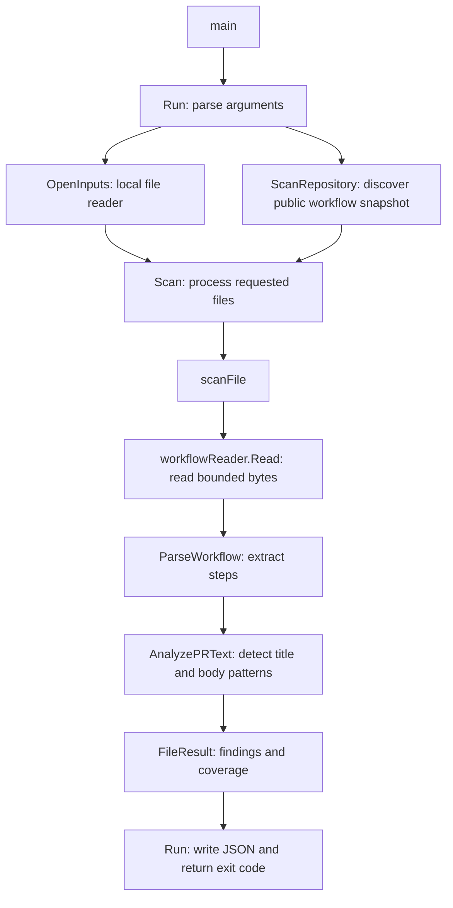

# Code walkthrough

The program has one executable and one application package. Two rules share one detector: `WH-R001` checks PR titles and `WH-R002` checks PR bodies. Start with the direct-title example and follow the calls below.

## Files from input to result

| File | Responsibility | Go concepts |
|---|---|---|
| [`main.go`](../cmd/hardener/main.go) | Passes arguments and output streams to `Run`, then exits with its result. | Packages, imports, function calls |
| [`cli.go`](../internal/hardener/cli.go) | Chooses local `--root`/`--file` or remote `--repo` mode; writes the report. | Standard `flag` package, slices, `io.Writer`, error handling |
| [`model.go`](../internal/hardener/model.go) | Defines the two rule IDs, scan scope, workflow, step, finding, and result structures. | Constants, structs, methods, JSON field tags |
| [`input.go`](../internal/hardener/input.go) | Reads bounded files beneath an input root and rejects links and unsafe paths. | File I/O, `os.Root`, `defer`, explicit errors |
| [`github.go`](../internal/hardener/github.go) | Validates a repository, resolves its default branch to a commit, discovers workflow blobs, and fetches bounded bytes. | HTTP requests, contexts, JSON decoding, interfaces |
| [`workflow.go`](../internal/hardener/workflow.go) | Walks YAML nodes to extract jobs, run steps, shells, and locations. | External packages, maps, slices, recursion |
| [`pr_text.go`](../internal/hardener/pr_text.go) | Checks the shell, recognizes direct title and body expressions, and groups evidence by rule within each step. | Loops, string operations, early returns |
| [`scan.go`](../internal/hardener/scan.go) | Connects reading, parsing, and detection; combines file results and exit codes. | Composition, sorting, `switch` |
| [`report.go`](../internal/hardener/report.go) | Writes indented JSON and limits diagnostic text. | `encoding/json`, interfaces, UTF-8 strings |

[`attrs_windows.go`](../internal/hardener/attrs_windows.go) and [`attrs_other.go`](../internal/hardener/attrs_other.go) provide the small platform-specific link checks. Go chooses the applicable file when building. The module path still matches the repository's name.

## Follow one example

For `hardener scan --file testdata/risky-title.workflow.txt`:

1. `main` calls `Run`. It parses the flags and opens the current directory as the input root.
2. `Scan` validates and sorts the requested filenames, then calls `scanFile` for each.
3. `Inputs.Read` checks the path and size and reads the file. It never runs the script.
4. `ParseWorkflow` extracts the `inspect` job's first step, its `bash` shell, its decoded `run` text, and the run value's source location.
5. `AnalyzePRText` calls `directPRTextExpressions` to check every expression in the step. It finds the exact title expression, returns one `WH-R001` finding, and records one analyzed step.
6. `scanFile` sets the status to `match`. `Scan` combines the totals, and `Run` writes JSON and returns exit 1.

With [the environment-variable example](../testdata/env-title.workflow.txt), the expression is outside `run`, so the supported step produces no finding and exit 0.

With [the direct-body example](../testdata/risky-body.workflow.txt), the same path produces a `WH-R002` finding. The shared expression check accepts only the exact title and body property names with surrounding ASCII spaces, tabs, CRs, or LFs. Unknown or incomplete expressions make the entire step unsupported for both rules.

With [the mixed title/body example](../testdata/mixed-title-body.workflow.txt), one step contains a title expression and two body expressions. The detector counts one analyzed step and emits two findings in rule-ID order: a title finding with one evidence entry and a body finding with two. A second matching step would produce its own findings with that step's location.

The overall JSON report uses `rule_ids` to list both checked rules, replacing the old report-level `rule_id`. Individual findings retain `rule_id`, which comes from `PRTitleRuleID` or `PRBodyRuleID` in `model.go`. The existing exit codes apply to the combined results.

With [the inherited-shell example](../testdata/default-shell-title.workflow.txt), the step omits its own shell. The detector records `unsupported_shell`, and the scan exits 2. It does not infer the workflow-level default. An unsupported step and a finding can coexist; incomplete analysis takes precedence in the exit code.

## Follow a repository scan

For `hardener scan --repo OWNER/REPO`:

1. `Run` rejects combinations with local input flags and calls `ScanRepository`.
2. `parseRepository` accepts a repository name or HTTPS GitHub URL and rejects credentials, other hosts, and extra URL components.
3. `scanRepository` requests public repository metadata, resolves the default branch to a commit SHA, and reads that commit's root tree SHA. Every subsequent tree and blob request uses a SHA.
4. It walks the root, `.github`, and `workflows` trees without recursion. Tree modes identify directories, ordinary files, links, and submodules. Truncated or malformed listings are errors.
5. It selects direct `.yml` and `.yaml` entries, validates paths, and passes a `githubInputs` reader and the filenames to the existing `Scan` function. `Scan` enforces file count and duplicate-name limits before any blob download.
6. `githubInputs.Read` checks file mode and size, then fetches bounded raw blob bytes. `scanFile` calls the same parser and detector as a local scan. Findings keep repository-relative paths and YAML locations.
7. The report includes `source.repository` and `source.commit`. Early discovery errors are top-level `issues`; file download and analysis errors remain file-level issues. Both cause exit 2. A download failure stops further HTTP requests and marks remaining files as errors, preserving earlier findings.

The small `workflowReader` interface has one method, `Read(name, limit)`. Both `Inputs` and `githubInputs` satisfy it, so fetching does not duplicate the rule logic or introduce another application package. Repository mode keeps bytes in memory and never writes or executes target code.

The HTTP client sends anonymous GET requests only to constructed `api.github.com` endpoints. It refuses redirects and does not consume URLs returned in metadata. Requests have a 15-second timeout and share a two-minute context deadline. Metadata is bounded to 1 MiB and workflow bytes to the existing 256-KiB limit.

## Manual GitHub workflow

[`scan-repository.yml`](../.github/workflows/scan-repository.yml) adds a `workflow_dispatch` string input. GitHub shows that input in its Run workflow form. The workflow checks out and builds the scanner, then maps the input to `TARGET_REPOSITORY` and passes `"$TARGET_REPOSITORY"` to `--repo`.

The scan step captures JSON, stderr, and the process exit code. The following steps render a summary with HTML-escaped repository text, filenames, and diagnostics and upload the report artifact even for findings or incomplete analysis. The final step applies the saved exit code, preserving the meanings of 0, 1, and 2 in the workflow result. Target scripts and dependencies are never run.

## Tests

Go's `_test.go` files stay next to the code and are excluded from the normal executable. Table-driven tests describe several inputs and expected outcomes using a slice and a loop.

- Input and parser tests check file boundaries, malformed YAML, step extraction, and source locations.
- Detector tests check both expression syntaxes, shell restrictions, repeated occurrences, mixed rules, step attribution, and unsupported cases.
- Scanner and CLI tests check combined results, argument handling, and output errors.
- [`github_test.go`](../internal/hardener/github_test.go) replaces the HTTP transport with simulated responses. It checks snapshot pinning, discovery, download bounds, links, redirects, rate limits, partial findings, and cancellation without live GitHub calls.
- [`main_test.go`](../cmd/hardener/main_test.go) builds the real executable and checks the fourteen synthetic examples, rule IDs, and process exit codes. It does not execute workflow scripts.

To understand the project incrementally, read `main.go` and `cli.go` first, follow the example above, then read the detector alongside its table-driven tests. The file checks and YAML validation can be studied after that central path is clear.
