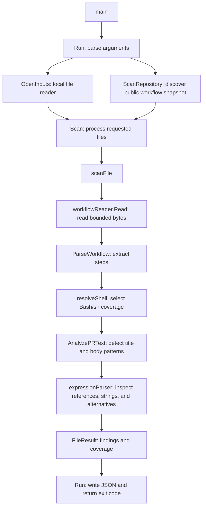

# Code walkthrough

The scanner has one command and one application package. A separate `find-candidates` executable uses that same package to collect provisional search matches. Two scanner rules share one detector: `WH-R001` checks PR titles and `WH-R002` checks PR bodies. Start with the direct-title example and follow the calls below.

## Files from input to result

| File | Responsibility | Go concepts |
|---|---|---|
| [`main.go`](../cmd/hardener/main.go) | Passes arguments and output streams to `Run`, then exits with its result. | Packages, imports, function calls |
| [`cli.go`](../internal/hardener/cli.go) | Chooses local `--root`/`--file` or remote `--repo` mode; writes the report. | Standard `flag` package, slices, `io.Writer`, error handling |
| [`model.go`](../internal/hardener/model.go) | Defines the two rule IDs, scan scope, workflow, step, finding, and result structures. | Constants, structs, methods, JSON field tags |
| [`input.go`](../internal/hardener/input.go) | Reads bounded files beneath an input root and rejects links and unsafe paths. | File I/O, `os.Root`, `defer`, explicit errors |
| [`github.go`](../internal/hardener/github.go) | Validates a repository, resolves its default branch to a commit, discovers workflow blobs, and fetches bounded bytes. | HTTP requests, contexts, JSON decoding, interfaces |
| [`workflow.go`](../internal/hardener/workflow.go) | Walks YAML nodes to extract jobs, run steps, shells, and locations. | External packages, maps, slices, recursion |
| [`shell.go`](../internal/hardener/shell.go) | Resolves step, job, and workflow shells, then supported runner/container defaults. | Pointers, presence checks, ordered selection, `switch` |
| [`pr_text.go`](../internal/hardener/pr_text.go) | Checks the shell, recognizes direct title and body expressions, and groups evidence by rule within each step. | Loops, string operations, early returns |
| [`expressions.go`](../internal/hardener/expressions.go) | Parses the supported expression subset, tracks PR references, and rejects unsupported syntax. | Cursor state, byte checks, methods, boolean results |
| [`scan.go`](../internal/hardener/scan.go) | Connects reading, parsing, and detection; combines file results and exit codes. | Composition, sorting, `switch` |
| [`report.go`](../internal/hardener/report.go) | Writes indented JSON and limits diagnostic text. | `encoding/json`, interfaces, UTF-8 strings |

[`attrs_windows.go`](../internal/hardener/attrs_windows.go) and [`attrs_other.go`](../internal/hardener/attrs_other.go) provide the small platform-specific link checks. Go chooses the applicable file when building. The module path still matches the repository's name.

## Follow one example

For `hardener scan --file testdata/risky-title.workflow.txt`:

1. `main` calls `Run`. It parses the flags and opens the current directory as the input root.
2. `Scan` validates and sorts the requested filenames, then calls `scanFile` for each.
3. `Inputs.Read` checks the path and size and reads the file. It never runs the script.
4. `ParseWorkflow` extracts the `inspect` job's first step, its decoded `run` text, and the run value's source location. It calls `resolveShell`, which selects the explicit `bash` shell.
5. `AnalyzePRText` calls `directPRTextExpressions` to check every expression in the step. That function passes each expression to `expressionParser.parse`, which recognizes the exact title reference. The detector returns one `WH-R001` finding and records one analyzed step.
6. `scanFile` sets the status to `match`. `Scan` combines the totals, and `Run` writes JSON and returns exit 1.

With [the environment-variable example](../testdata/env-title.workflow.txt), the expression is outside `run`, so the supported step produces no finding and exit 0.

With [the direct-body example](../testdata/risky-body.workflow.txt), the same path produces a `WH-R002` finding. The shared expression parser also accepts other context references, single-quoted strings, and `||` alternatives. Unsupported or incomplete expressions make the entire step unsupported for both rules.

With [the mixed title/body example](../testdata/mixed-title-body.workflow.txt), one step contains a title expression and two body expressions. The detector counts one analyzed step and emits two findings in rule-ID order: a title finding with one evidence entry and a body finding with two. A second matching step would produce its own findings with that step's location.

The overall JSON report uses `rule_ids` to list both checked rules, replacing the old report-level `rule_id`. Individual findings retain `rule_id`, which comes from `PRTitleRuleID` or `PRBodyRuleID` in `model.go`. The existing exit codes apply to the combined results.

With [the inherited-shell example](../testdata/default-shell-title.workflow.txt), the step omits its own shell. `resolveShell` selects the workflow's `defaults.run.shell: bash`, so the title finding is reported with exit 1. An unsupported step and a finding can still coexist; incomplete analysis takes precedence in the exit code.

## Resolve the shell

`defaultShell` validates workflow and job `defaults.run` mappings and returns their shell nodes. A nil pointer means the setting is absent; a present empty string must block fallback. A job default that only sets `working-directory` returns no shell, allowing inheritance from the workflow. Structurally malformed defaults and non-string shells are parsing errors.

`resolveShell` checks step, job, then workflow shell nodes. The first present setting must be exactly `bash` or `sh`; any other selected value returns an unresolved result. A supported explicit or inherited setting does not need runner or container inference.

When no shell setting is present, the resolver uses the eight scalar Ubuntu/macOS runner labels listed in [the README](../README.md#shell-selection). Without a job container, it returns the internal `bash-or-sh` marker to represent Bash with a possible `sh` fallback. For an allowlisted Ubuntu runner with a literal container image, it returns `sh`. Other runner/container contexts remain unresolved. The internal marker is never accepted as a literal `shell` value.

`Step.Shell` holds this resolved value or an empty string for unsupported cases. `Step.ShellExplicit` records whether the step declared a shell; it no longer determines coverage. `AnalyzePRText` accepts the three supported resolved values and then checks expression coverage. The report's JSON fields and run-value source locations stay the same.

[The mixed container example](../testdata/mixed-container-body.workflow.txt) has seven run steps. Shell resolution and expression parsing support all seven, including the branch fallbacks and synthetic secret reference. The result contains the explicit Bash step's body finding, seven analyzed steps, no issues, and exit 1. Recognizing a secret reference does not access its value.

## Parse expressions

`directPRTextExpressions` searches the decoded script for `${{`. For each opener, it creates an `expressionParser` with a cursor just after the opener. On success, the cursor is just after the closing `}}`, so the full original expression can be kept as evidence and scanning resumes from that position.

`expressionParser.parse` reads a term, then either the closing delimiter or `||` followed by another term. A term is a dotted context reference or a single-quoted string. `reference` checks the context allowlist and property identifiers described in [the README](../README.md#supported-expressions). `quotedString` consumes literal text, including doubled apostrophes, so `}}`, `||`, and PR paths inside strings do not become syntax or findings. The cursor moves forward without recursion or evaluating any values.

The parser records two booleans: whether any alternative references the exact PR title or body path. Every alternative is inspected, including those after a nonempty string literal. Case variants of the two PR paths remain unsupported. Other accepted references add no PR finding; this is not data-flow analysis or a safety assessment of their values.

Each successful expression contributes at most one evidence entry to each rule. In [the PR-fallback example](../testdata/pr-fallbacks.workflow.txt), the body reference appears twice within one expression but contributes only one body evidence entry. Repeating the entire expression contributes a second entry. Findings are still grouped by step and ordered by rule ID.

The parser must consume every expression completely. An unsupported function, unexpected token, or missing operand returns an unsupported result. `directPRTextExpressions` then discards any evidence collected for that step. In [the partial-body example](../testdata/mixed-support-body.workflow.txt), the supported first step keeps its finding, while the second step's `toJSON` expression produces `unsupported_expression` and exit 2.

## Follow a repository scan

For `hardener scan --repo OWNER/REPO`:

1. `Run` rejects combinations with local input flags and calls `ScanRepository`.
2. `parseRepository` accepts a repository name or HTTPS GitHub URL and rejects credentials, other hosts, and extra URL components.
3. `scanRepository` requests public repository metadata, resolves the default branch to a commit SHA, and reads that commit's root tree SHA. Every subsequent tree and blob request uses a SHA.
4. It walks the root, `.github`, and `workflows` trees without recursion. Tree modes identify directories, ordinary files, links, and submodules. Truncated or malformed listings are errors.
5. It selects direct `.yml` and `.yaml` entries, validates paths, and passes a `githubInputs` reader and the filenames to the existing `Scan` function. `Scan` enforces file count and duplicate-name limits before any blob download.
6. `githubInputs.Read` checks file mode and size, then fetches bounded raw blob bytes. `scanFile` calls the same parser and detector as a local scan. Findings keep repository-relative paths and YAML locations.
7. The report includes `source.repository` and `source.commit`. Early discovery errors are top-level `issues`; file download and analysis errors remain file-level issues. Both cause exit 2. A download failure stops further HTTP requests and marks remaining files as errors, preserving earlier findings.

The small `workflowReader` interface has one method, `Read(name, limit)`. Both `Inputs` and `githubInputs` satisfy it, so fetching does not duplicate the rule logic or introduce another application package. Repository mode keeps bytes in memory and never writes or executes target code.

The HTTP client sends anonymous GET requests only to constructed `api.github.com` endpoints. It refuses redirects and does not consume URLs returned in metadata. Requests have a 15-second timeout and share a two-minute context deadline. Metadata is bounded to 1 MiB and workflow bytes to the existing 256-KiB limit.

## Manual GitHub workflow

[`scan-repository.yml`](../.github/workflows/scan-repository.yml) adds a `workflow_dispatch` string input. GitHub shows that input in its Run workflow form. The workflow checks out and builds the scanner, then maps the input to `TARGET_REPOSITORY` and passes `"$TARGET_REPOSITORY"` to `--repo`.

The scan step captures JSON, stderr, and the process exit code. The following steps render a summary with HTML-escaped repository text, filenames, and diagnostics and upload the report artifact even for findings or incomplete analysis. The final step applies the saved exit code, preserving the meanings of 0, 1, and 2 in the workflow result. Target scripts and dependencies are never run.

## Candidate discovery

[`cmd/find-candidates/main.go`](../cmd/find-candidates/main.go) passes arguments, the `GH_TOKEN` environment value, and output streams to `RunCandidates` in [`candidates.go`](../internal/hardener/candidates.go). It creates a new `candidates.json`, then calls `FindCandidates` with a two-minute network deadline. It accepts no search options and does not change the scanner's `Run` or `scan` command.

Discovery processes four fixed REST queries, requesting one page of 25 items each with at least six seconds between searches. It validates each result, deduplicates repository/path/blob SHA combinations, and anonymously fetches at most 20 blobs. It reuses the existing HTTP client timeout/redirect policy, repository and SHA patterns, portable-path validation, byte limits, and JSON writer. Its authenticated search requests are separate from the scanner's anonymous HTTP path.

Four case-sensitive Go regex filters cover the two documented layouts and two PR fields. Each emits at most one candidate per file/filter/field, identifying the blob and first regex match's starting line. No YAML parsing or scanner rules run during discovery. Errors and sampling omissions make the report incomplete and return exit 2 while preserving candidates; complete discovery returns 0 even when candidates exist. See the [search guide](SEARCHING.md#automated-candidate-discovery) for authentication, output details, and limitations. A live discovery workflow and the later bulk scan are not included.

## Tests

Go's `_test.go` files stay next to the code and are excluded from the normal executable. Table-driven tests describe several inputs and expected outcomes using a slice and a loop.

- Input and parser tests check file boundaries, malformed YAML, step extraction, and source locations. [`shell_test.go`](../internal/hardener/shell_test.go) covers shell precedence, container/platform defaults, blocked fallback, malformed defaults, and unresolved contexts.
- Detector and expression tests check context references, strings containing delimiters, fallback alternatives, repeated evidence, mixed rules, step attribution, malformed/unsupported syntax, shell restrictions, and a long fallback chain.
- Scanner and CLI tests check combined results, argument handling, and output errors.
- [`github_test.go`](../internal/hardener/github_test.go) replaces the HTTP transport with simulated responses. It checks snapshot pinning, discovery, download bounds, links, redirects, rate limits, partial findings, and cancellation without live GitHub calls. Shell and expression fixtures must produce the same findings, locations, and coverage in local and repository scans.
- [`candidates_test.go`](../internal/hardener/candidates_test.go) uses fake HTTP responses, synthetic tokens, and an injected pacing function. It checks both regex layouts, source attribution, deduplication, metadata validation, sampling and byte limits, partial failures, cancellation, credential handling, and output-file behavior without network calls or real search delays.
- [`main_test.go`](../cmd/hardener/main_test.go) builds the real executable and checks the twenty-one synthetic examples, rule IDs, and process exit codes. It does not execute workflow scripts.

To understand the project incrementally, read `main.go` and `cli.go` first, follow the example above, then read the detector alongside its table-driven tests. The file checks and YAML validation can be studied after that central path is clear.
