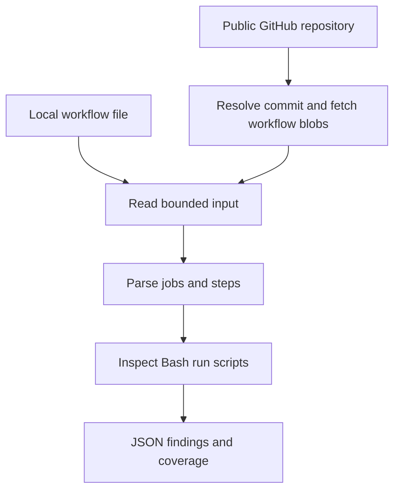

# 001: Make the README flowchart vertical

Status: Implemented

## Request and problem

The owner asked to rotate the flowchart in `README.md` because it looks small in the UI. The current left-to-right layout spreads the stages across the available width, which can make the rendered labels small.

The owner also requested this spec review process. Its setup is authorized by that request; the chart change is the first proposal to review before implementation.

## Proposed change

Change the Mermaid diagram under **How it works** in [README.md](../README.md) from left-to-right (`LR`) to top-to-bottom (`TD`):

```diff
-flowchart LR
+flowchart TD
```

Preserve every node, label, and connection. The code walkthrough already uses a top-to-bottom diagram and needs no edit. This is a documentation-only change with no scanner or CI behavior changes.

Proposed diagram:



## Acceptance criteria

- The README's How it works diagram flows from top to bottom.
- Both input routes and all processing stages retain their existing labels and connections.
- In the rendered README, the diagram is narrower and its labels are readable at normal page zoom.

## Validation plan

- Review the diff to confirm that only the diagram direction changes in the README.
- Run `git diff --check` to check whitespace.
- Inspect the rendered diagram if a Markdown preview is available. Otherwise, explicitly report that visual verification remains outstanding for owner review.
- No Go tests are needed for this documentation-only change, and no project code will be executed locally.

## Open questions

None.

## Implementation and validation results

The owner approved implementation in the conversation: "thanks, continue with the implementation".

- Changed the README diagram from `flowchart LR` to `flowchart TD`.
- Reviewed the README diff: only the direction changed; all nodes, labels, and connections are preserved.
- `git diff --check` passed.
- Visual verification of the rendered README remains outstanding; no rendered preview was inspected.
- Go tests were not run because this is a documentation-only change. No project code was executed locally.
